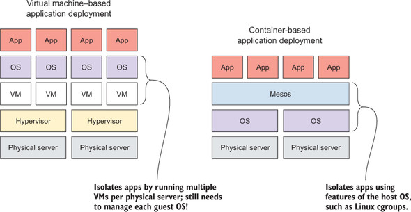
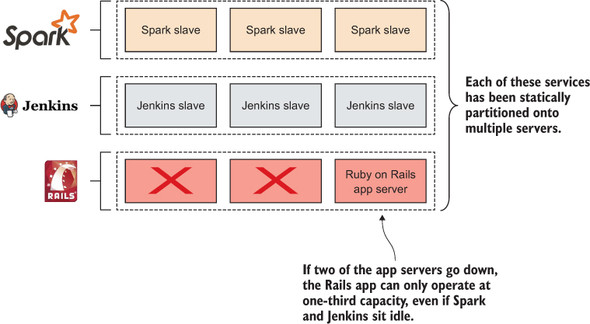
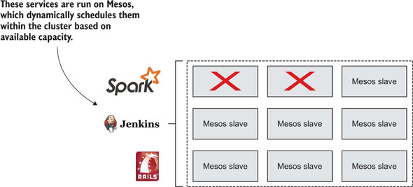

# Mesos and the State of Application Deploys

## Who Am I?

* Kory Brown. <!-- .element: class="fragment" data-fragment-index="1" -->
* DevOps Engineer From Texas. <!-- .element: class="fragment" data-fragment-index="2" -->
* Site Operations Engineer at Fitbit. <!-- .element: class="fragment" data-fragment-index="3" -->

## What is This Talk About?

## Mesos! <!-- .element: class="fragment strike" -->

## Application Deployments!

## More Specifically

* How we, as an industry, used to handle application deployments. <!-- .element: class="fragment" -->
* How we, as an industry, currently handle application deployments. <!-- .element: class="fragment" -->
* How I think we'll handle application deployments in the future. <!-- .element class="fragment" -->

## Wait, What about Mesos?

We'll get there. <!-- .element: class="fragment" -->

But to understand the problems Mesos solves for deploys we must first:
* Understand what we do today. <!-- .element: class="fragment" -->
* Understand how we got here. <!-- .element: class="fragment" -->

Mesos, in this case, is an implementation detail. <!-- .element class="fragment" -->

## Why Should You Care?

* It's super freaking cool <!-- .element: class="fragment" -->
* And you know... DevOps <!-- .element: class="fragment" -->

Note:

* You've likely got a whole operations team that handles this for you.
* Orchestration that allows an entire datacenter to act as a single unit of computing power.
* People hear DevOps and think "Oh, I need to hire a team of people like Kory, and they'll automate servers away and I never have to think about it again!"
* I mean, please keep hiring me to do that, but that alone won't help you build better software.

## What is DevOps?

* This is not a talk on DevOps... <!-- .element: class="fragment" -->
* ... but it's important for us to have a common definition. <!-- .element: class="fragment" -->

Note:

* It really gets to the heart of why you should care about this sort of thing.

>"DevOps is about recognizing that the backing infrastructure is not separate from your application, but rather a vital part of it."

Note:

* I thought long and hard on how to distill the essence of the DevOps culture for this talk, and this feels the most right.

## How Things Used to Be

## You Want to Deploy

1. Get a Server. <!-- .element: class="fragment" -->

### Get a Server

* Put in a request. <!-- .element: class="fragment" -->
* A human allocates a server. <!-- .element: class="fragment" -->
* A human installs an operating system. <!-- .element: class="fragment" -->
* A human ensures the networking is correct. <!-- .element: class="fragment" -->
* A human installs all specified dependencies. <!-- .element: class="fragment" -->
* etc, etc, etc <!--.element: class="fragment" -->

Note:

* Note that at every step, this process involves a human.
* And likely has coordination between multiple humans.
* Probably all on different teams.

## You Want to Deploy

1. Get a Server. <!-- .element: class="fragment strike" -->
2. Deploy your application. <!-- .element: class="fragment" -->

### Deploy Your Application

* An Ops guy logs into the server. <!-- .element: class="fragment" -->
  * Downloads your application. <!-- .element: class="fragment" -->
  * Installs your application. <!-- .element: class="fragment" -->
  * Configures your application. <!-- .element: class="fragment" -->

### Deploy Your Application

* The application doesn't start.
  * They call you (probably in the middle of the night). <!-- .element: class="fragment" -->
  * After an hour of troubleshooting, you realize they typoed the config. <!-- .element: class="fragment" -->
  * You hate everything. <!-- .element: class="fragment" -->

## You Want to Deploy

1. Get a Server. <!-- .element: class="fragment strike" -->
2. Deploy your application. <!-- .element: class="fragment strike" -->
3. Repeat n times for scale. <!-- .element: class="fragment" -->
  * Each time slightly differently <!-- .element: class="fragment" -->

## Something Goes Wrong
(Hardware failure/OS issues/Maintenance/etc)

God Help You. <!-- .element: class="fragment" -->

Note:

* Now that all that work is done, let's say the machine is acting up, and we discover bad RAM or something.

## Something Goes Wrong
(Hardware failure/OS issues/Maintenence/etc)

* File a ticket.
* Datacenter tech finds the machine. <!-- .element: class="fragment" -->
* They pull the hard drive. <!-- .element: class="fragment" -->
  * Which is weird, because I said the RAM tested bad. <!-- .element: class="fragment" -->
* Two weeks later the machine is lost in a sea of tickets. <!-- .element: class="fragment" -->
* Everything is terrible. <!-- .element: class="fragment" -->

### This Sucked

* Not uncommon to measure turnaround in weeks. <!-- .element: class="fragment" -->
* Little to no automation. <!-- .element: class="fragment" -->
* Incredibly error prone. <!-- .element: class="fragment" -->
* Requires a person at most every step. <!-- .element: class="fragment" -->
* Generally leads to finely crafted artisanal machines. <!-- .element: class="fragment" -->

**TL;DR:** <!-- .element: class="fragment" -->

Horrifically inefficient, error prone, and time consuming. <!-- .element: class="fragment" -->

Note:

* At my first gig, it was not uncommon for it to take 2 weeks to get a new machine from start to finish.

## How things are Today

## You Want to Deploy

1. Spin up a new cloud instance. <!-- .element: class="fragment" -->
2. Run your automation tool of choice (Puppet/Ansible/Chef/etc). <!-- .element: class="fragment" -->
3. Repeat n times. <!-- .element: class="fragment" -->

## Something Goes Wrong
(Hardware failure/OS issues/Maintenance/etc)

Spin up a new instance! <!-- .element: class="fragment" data-fragment-index="1" -->

Turn around times are so low, who cares? <!-- .element: class="fragment" data-fragment-index="1" -->

Birth of the "Treat servers like Cattle, not pets" thought process. <!-- .element: class="fragment" data-fragment-index="2" -->

### Sucks Way Less

* Turnaround measured in minutes. <!-- .element: class="fragment" -->
* Almost entirely automated. <!-- .element: class="fragment" -->
* Fairly deterministic. <!-- .element: class="fragment" -->
* Doesn't have to involve people at all! <!-- .element: class="fragment" -->

### But Not Perfect

* Still manage an entire OS for each application. This includes: <!-- .element: class="fragment" -->
  * Updates! (Both OS and any applications/libraries) <!-- .element: class="fragment" -->
  * Backups! <!-- .element: class="fragment" -->
  * Monitoring/Metrics! <!-- .element: class="fragment" -->
  * etc, etc, etc <!-- .element: class="fragment" -->

Note:

* Let's say I run some web service, and I have 5 app servers, 3 database machines, and two web servers.
* I have to maintain _all_ of that for 10 machines!

### But Not Perfect

* Not fully utilizing the available hardware. 
  * Unless your application runs constantly at 100% CPU and RAM, you are wasting cycles and money! <!-- .element: class="fragment" -->

### But Not Perfect

**TL;DR:** 

Good, but not great past a certain scale. <!-- .element: class="fragment" -->

## Enter Mesos

### What is Mesos?

* Open source distributed cluster management tool. <!-- .element: class="fragment" -->

### What is Mesos?

* An abstraction layer for computing resources (CPU/RAM/Disk/etc) contained within a pool of servers.

### Mesos is a Distributed Kernel

* A traditional Kernel (like Linux!) provides a set of APIs for interacting with available hardware on a local machine. <!-- .element: class="fragment" -->

* A distributed Kernel (like Mesos!) provides a set of APIs for interacting with available hardware on a pool of servers. <!-- .element: class="fragment" -->

### The Datacenter OS

* The Kernel itself is a small part of an Operating System. <!-- .element: class="fragment" -->
* Many other components that make it something useful. <!-- .element: class="fragment" -->
* Most relevant for us right now: <!-- .element: class="fragment" -->
  * Init system -- Some process to manage the lifecycle of other processes. <!-- .element: class="fragment" -->
  * Cron -- Some process to run tasks on some specified interval <!-- .element: class="fragment" -->

Mesos implements this functionality with "Frameworks". <!-- .element: class="fragment" -->

## What's a Framework?

* A Mesos "Application". <!-- .element: class="fragment" -->
* Composed of: <!-- .element: class="fragment" -->
  * A scheduler, which registers with the Master, and receives resource offers. <!-- .element: class="fragment" -->
  * One or more Executors, which launches tasks on slaves. <!-- .element: class="fragment" -->

## Mesos Frameworks

* Init System: <!-- .element: class="fragment" -->
  * Marathon <!-- .element: class="fragment" -->
  * Aurora <!-- .element: class="fragment" -->

* Cron: <!-- .element: class="fragment" -->
  * Chronos <!-- .element: class="fragment" -->
  * Aurora <!-- .element: class="fragment" -->

Note:

* Most of my anecdotal examples assume Aurora, because that's what we use at Fitbit.

### A Quick Aside on Frameworks

The Frameworks listed are just ones that are relevant in the context of application deploys.

### A Quick Aside on Frameworks

Mesos is meant to be used as a generic computing cluster manager, which means you can also use, as a framework:

* Jenkins <!-- .element: class="fragment" -->
* Hadoop <!-- .element: class="fragment" -->
* Spark <!-- .element: class="fragment" -->
* Storm <!-- .element: class="fragment" -->
* Kafka <!-- .element: class="fragment" -->
* Many more things probably! <!-- .element: class="fragment" -->

Perhaps more importantly, all of these frameworks can share the same cluster of machines! <!-- .element: class="fragment" -->

Note:

* Not required to maintain a "Jenkins" cluster, and a "Hadoop" cluster, you would simply maintain "The Cluster".

## Mesos Offers

* A list of an agent node's available resources (CPU/RAM/Disk/etc). <!-- .element: class="fragment" -->
* Two-Tier Scheduling System. <!-- .element: class="fragment" -->
  * Agent Node sends resources to Master node. <!-- .element: class="fragment" -->
  * Master node uses an algorithm called "Dominant Resource Fairness" to fairly pass that resource offer to it's registered Frameworks. <!-- .element: class="fragment" -->

Note:

* Let's say an offer comes in with 10 Cores and 32GB of RAM.
* Mesos Offers Jenkins, it takes 6 cores, and 8GB of RAM.
* Mesos then Offers Hadoop, it takes 2 cores, and 16GB of RAM.
* etc, etc, etc

### Other Mesos Related Words

* **Master:** Runs on master node, manages agents.

* **Agent:** Runs tasks that belong to frameworks.
  * Previously referred to as a Slave, but this is being changed in newer versions.

* **Task:** A unit of work scheduled by the Framework, and executed on the Agent.

* **ZooKeeper:** Distributed consensus framework.

### Mesos Architecture

## Should my App Run on Mesos?

### Stateless Application

* Web App (Rails, Django, Play, etc) <!-- .element: class="fragment" -->
* Jenkins Build Slaves <!-- .element: class="fragment" -->
* Memcached <!-- .element: class="fragment" -->

** Yes ** <!-- .element: class="fragment" -->

## Stateful Applications

* MySQL <!-- .element: class="fragment" -->
* PostgresSQL <!-- .element: class="fragment" -->
* Jenkins Master <!-- .element: class="fragment" -->

** No ** <!-- .element: class="fragment" -->

Note:

* Really, anything that relies heavily upon persisting to disk is a bad idea.
* There is support for persistent storage, but it's not as useful as you'd think.
  * Just means it won't delete your data when it's done.
  * If you **must** have it, consider something like HDFS or an external mount point.
  * Really just not designed for this type of problem.

### Does it Address Current Problems?

* Managing fewer Operating Systems.
* Better utilization.

Note:

* In one of my deploy sceneraios above, I specifically called out having to manage an OS for every deployment of my application, as well as inefficiencies in utilization.

### Managing fewer Operating Systems

Manage an OS for each physical host, NOT each application. <!-- .element: class="fragment" -->

### Better Utilization

Instead of one application running per host...

... we bin pack them all together! <!-- .element: class="fragment" -->

Any resources your application isn't using can be shared as needed! <!-- .element: class="fragment" -->

### BONUS: Redundancy Baked In!

Since we have this big pool of shared resources, if an instance or host dies, we just reschedule it somewhere else.

### Statically Provisioned Cluster

### Dynamically Provisioned Cluster

## Deploying with Mesos

## You want to Deploy

1. Write a Job Config for your Framework of Choice. <!-- .element: class="fragment" -->
  * We use Aurora -- it's pretty sweet. <!-- .element: class="fragment" -->
2. Tell Aurora to run it. <!-- .element: class="fragment" -->

## Something Goes Wrong
(Hardware failure/OS issues/Maintenance/etc)

* Aurora reschedules your application to another node. <!-- .element: class="fragment" -->

### Hardly Sucks at All!

* Turnaround measured in seconds! <!-- .element: class="fragment" -->
* Entirely automated! <!-- .element: class="fragment" -->
* Deterministic! <!-- .element: class="fragment" -->
* Fault Tolerant! <!-- .element: class="fragment" -->

## Developer Perspective

### Testing

* Mesos can be your dev, qa, staging, and production environments. <!-- .element: class="fragment" -->
  * Aurora splits permissions and allocations between configured environments. <!-- .element: class="fragment" -->
  * Prioritizes production. Meaning it will preempt jobs running in "lesser" environments. <!-- .element: class="fragment" -->

Becomes easy to test in a Prod like environment because it IS the same environment! <!-- .element: class="fragment" -->

### Self-Management

* No more waiting on Ops for hardware! <!-- .element: class="fragment" data-fragment-index="1" -->
* Easily automate-able! <!-- .element: class="fragment" data-fragment-index="2" -->
  * Want Heroku styled deploys? <!-- .element: class="fragment" data-fragment-index="3" -->
  * <!-- .element: class="fragment" data-fragment-index="4" --> _This is how Heroku does it._ <!-- .element: class="fragment" data-fragment-index="4" -->

## TL;DR

* We've come a long long way. <!-- .element: class="fragment" -->
* Thing's suck way less now. <!-- .element: class="fragment" -->
* Sucking less and less every day. <!-- .element: class="fragment" -->

# Questions?
